---
## Front matter
lang: ru-RU
title: Лабораторная работа №1
subtitle: Основы информационной безопасности
author:
  - Оширова Юлия Николаевна
institute:
  - Российский университет дружбы народов, Москва, Россия
  - ФФМиЕН, Компьютерные и информационные науки 
date: 17 февраля 2024

## i18n babel
babel-lang: russian
babel-otherlangs: english

## Formatting pdf
toc: false
toc-title: Содержание
slide_level: 2
aspectratio: 169
section-titles: true
theme: metropolis
header-includes:
 - \metroset{progressbar=frametitle,sectionpage=progressbar,numbering=fraction}
 - '\makeatletter'
 - '\beamer@ignorenonframefalse'
 - '\makeatother'
---

# Информация

## Докладчик

:::::::::::::: {.columns align=center}
::: {.column width="70%"}

  * Оширова Юлия Николаевна
  * студентка группы НКАбд-02-22
  * Российский университет дружбы народов
  * [1132222843@rudn.ru](mailto:1132222843@rudn.ru)

:::
::: {.column width="30%"}

:::
::::::::::::::

# Вводная часть

## Цели и задачи

Целью данной работы является приобретение практических навыков установки операционной системы на виртуальную машину, настройки минимально необходимых для дальнейшей работы сервисов. Установить дистрибутив Rocky. Выполнить домашнее задание. Сделать отчет и презентацию по данной лабораторной работе.

# Теоретическое введение

Rocky Linux — это дистрибутив Linux, разработанный Rocky Enterprise Software Foundation. Предполагается, что это будет полный бинарно-совместимый выпуск, использующий исходный код операционной системы Red Hat Enterprise Linux. 

# Выполнение лабораторной работы

***Подготовка виртуальный машины***

Создадим виртуальную машину:

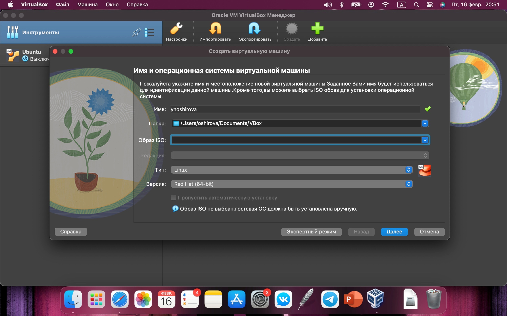{#fig:001 width=70%}

Добавим в нее раздел на 20 ГБ памяти, а также подключим iso образ инсталятора Rocky Linux, а также установим виртуальный жесткий диск и т.д.:

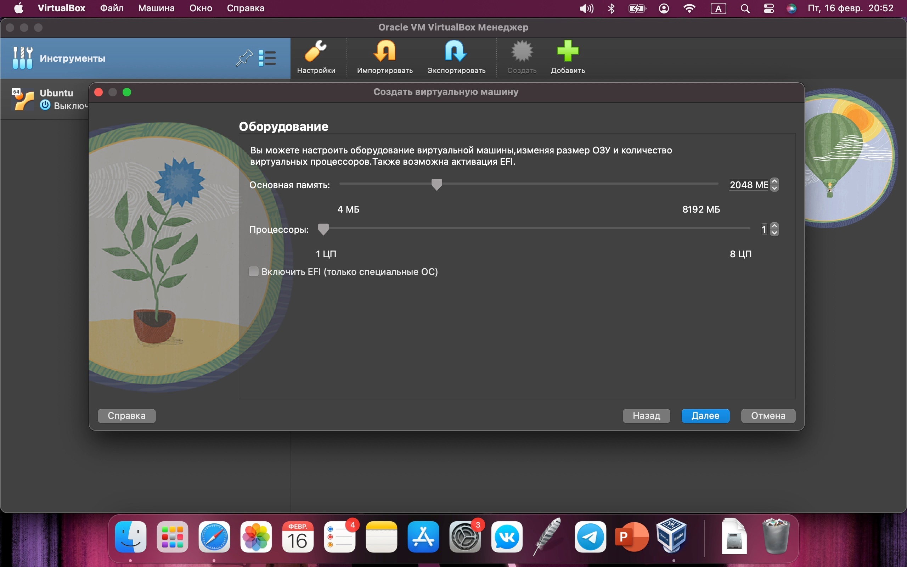{#fig:002 width=70%}

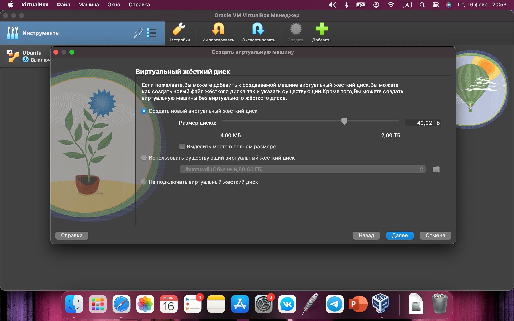{#fig:003 width=70%}

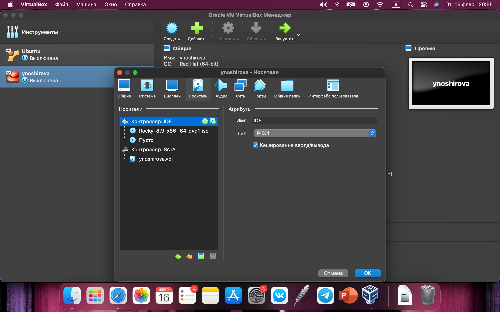{#fig:004 width=70%}

Запустим и перейдем к установке.

***Установка Rocky Linux***

Выбираем язык English и язык English (United States):

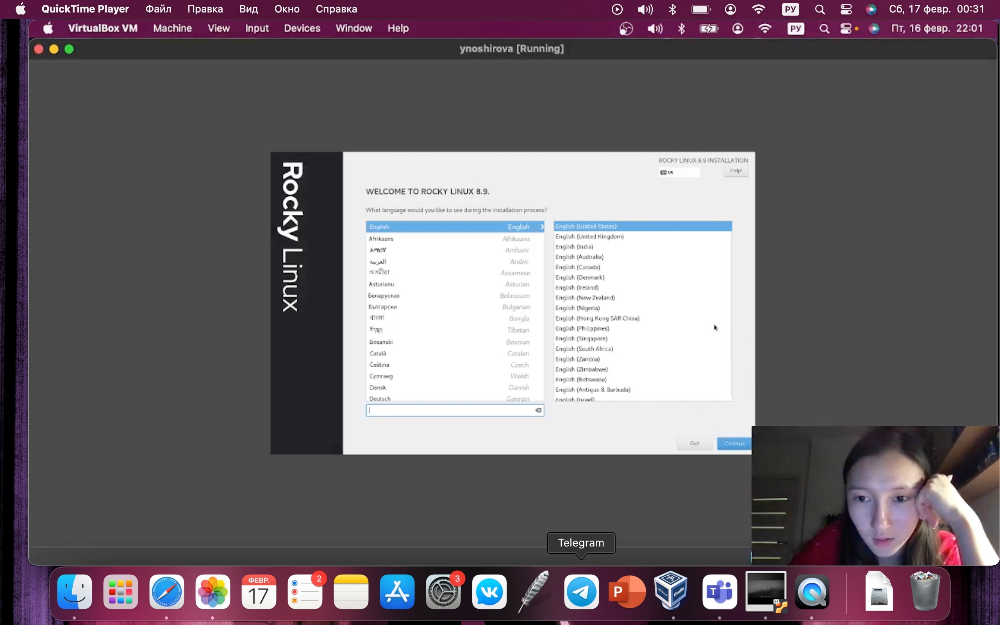{#fig:005 width=70%}

Выбираем автоматическую разметку диска:

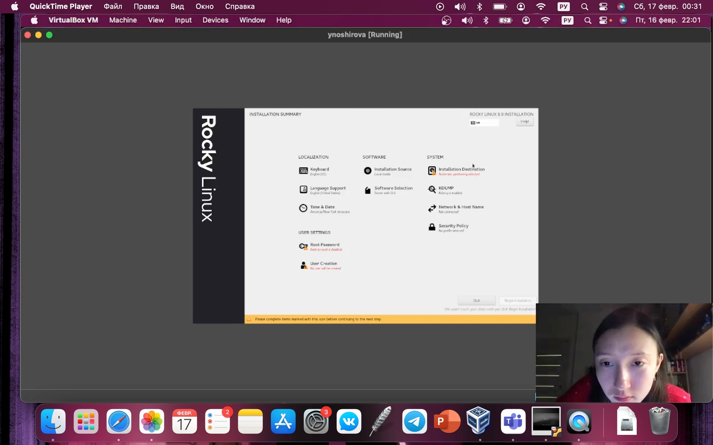{#fig:006 width=70%}

Добавляем нового пользователя, учитывая соглашение об именовании.

В предустанавливаемом ПО выбираем базовое окружение “Сервер с GUI” и группу “Developments tool”:

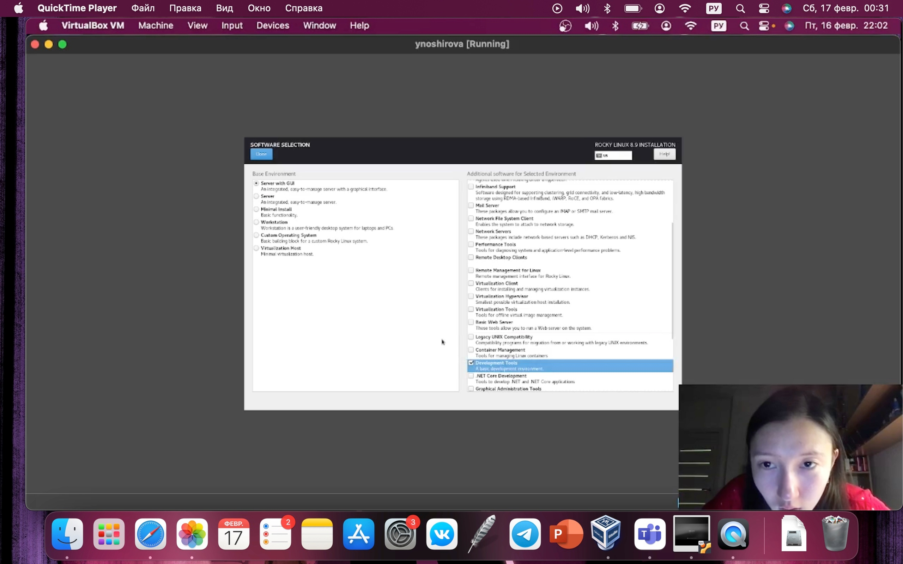{#fig:008 width=70%}

Отключаем kdump:

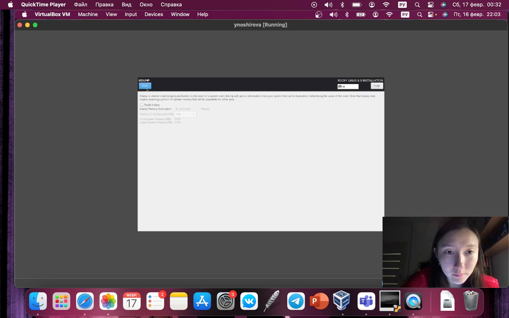{#fig:007 width=70%}

Проверяем installation destination:

{#fig:007 width=70%}

Выставляем пароль для рута:

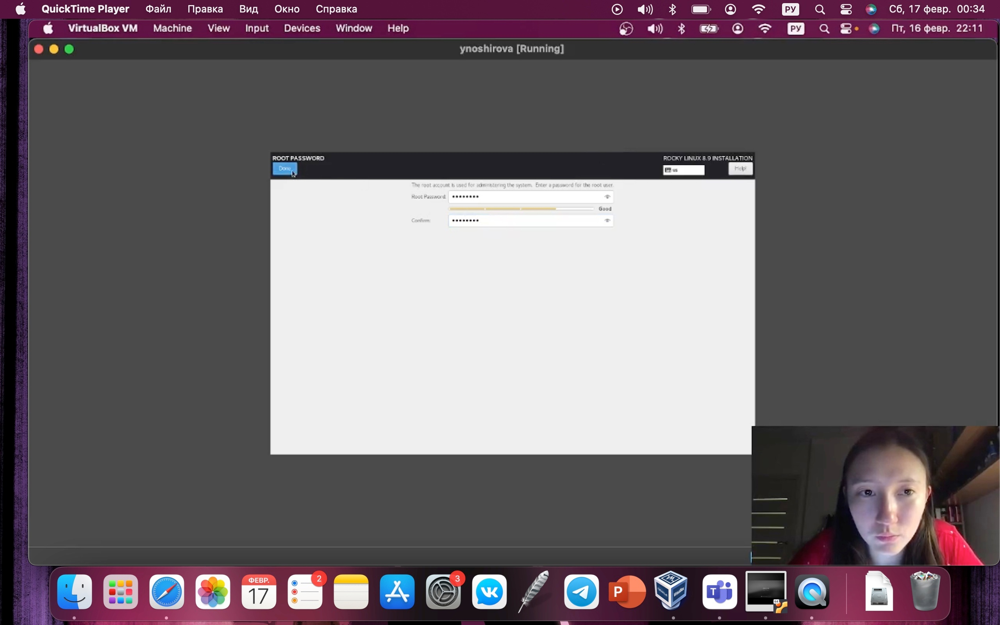{#fig:011 width=70%}

Задаем hostname:

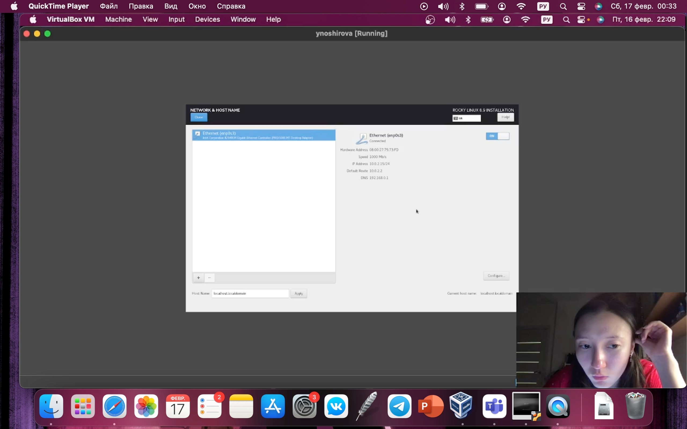{#fig:010 width=70%}

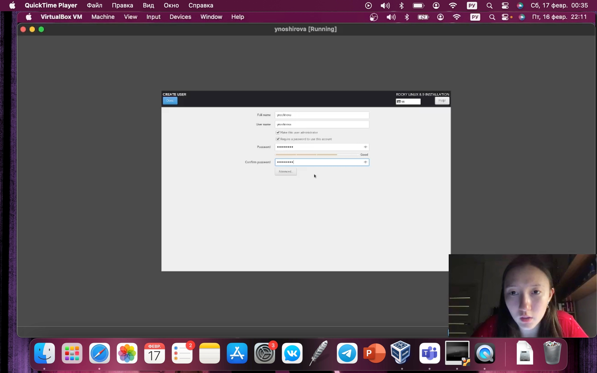{#fig:012 width=70%}

Принимаем лицензию:

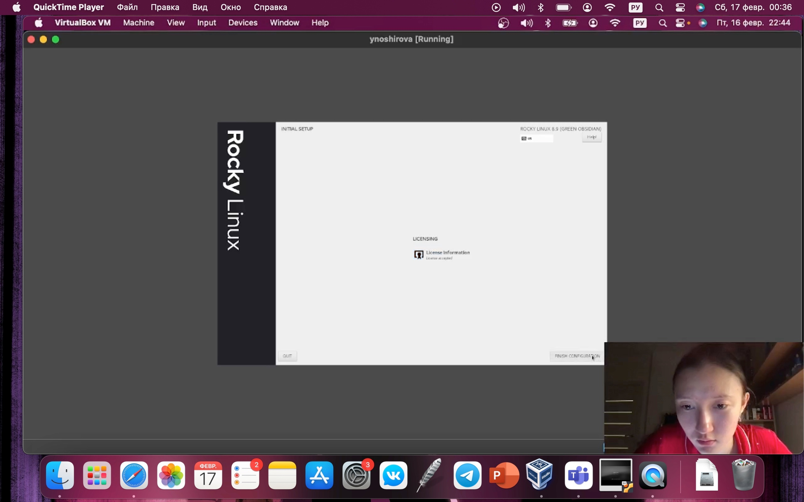{#fig:013 width=70%}

Запускаем установку:

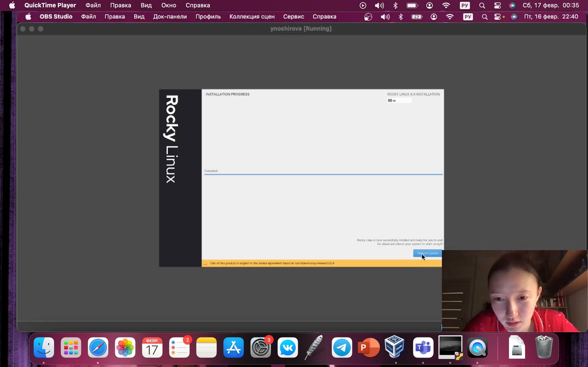{#fig:014 width=70%}

Проверяем правильность установленного hostname и username (согласно соглашению об именовании).

Подключаем образ диска дополнений гостевой ОС:

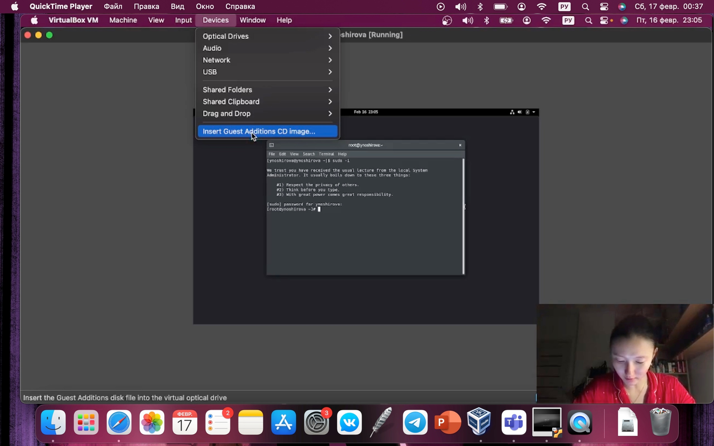{#fig:015 width=70%}

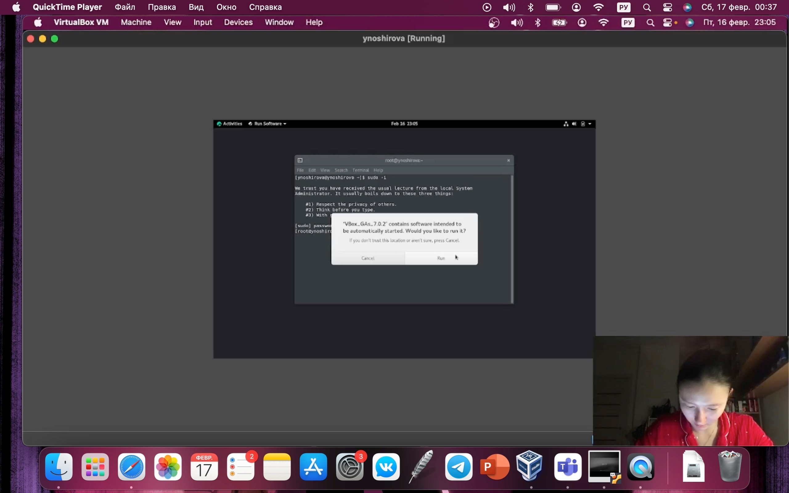{#fig:018 width=70%}

# Вывод

В ходе данной лабораторной работы мы ознакомились и установили новый дистрибутив Rocky. Выполнили домашнее задание с командой «dmesg».
