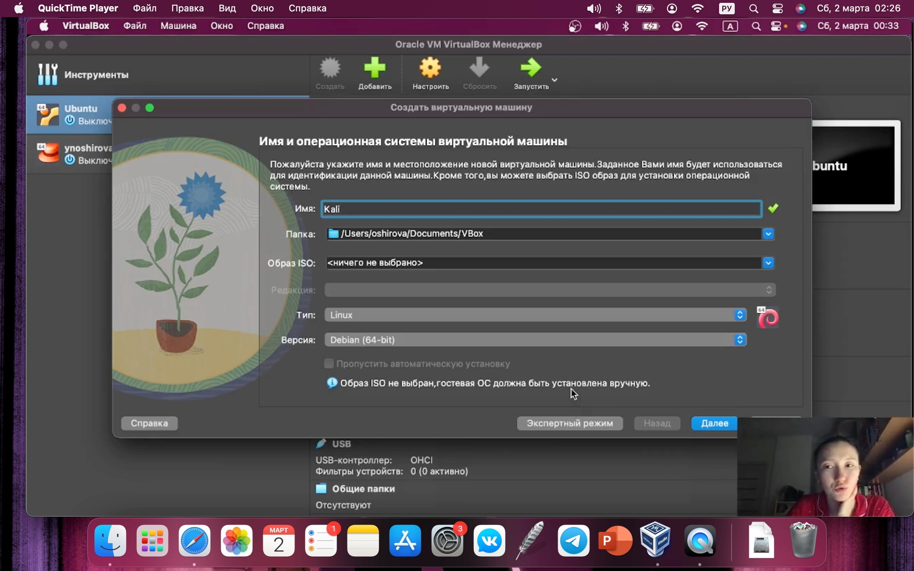
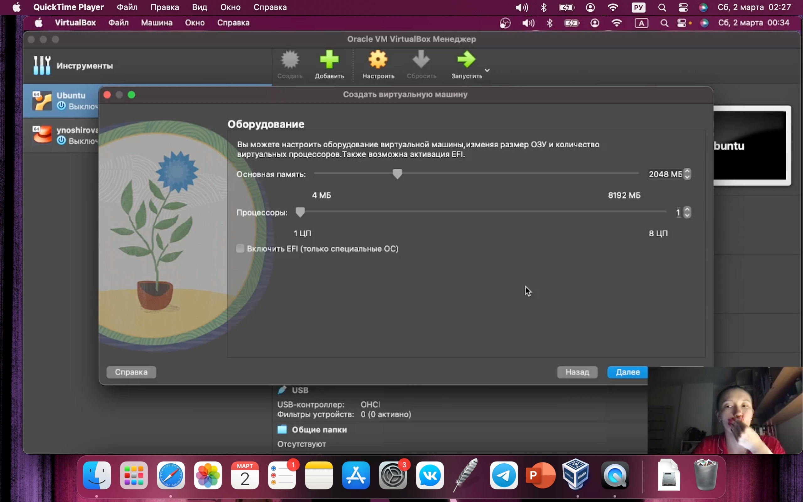
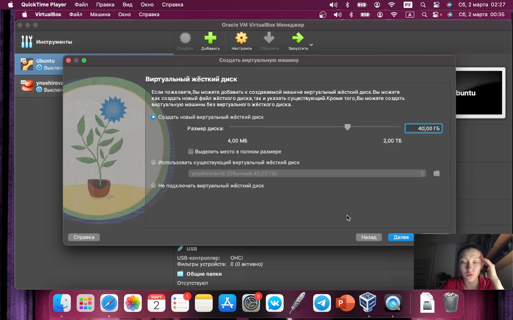
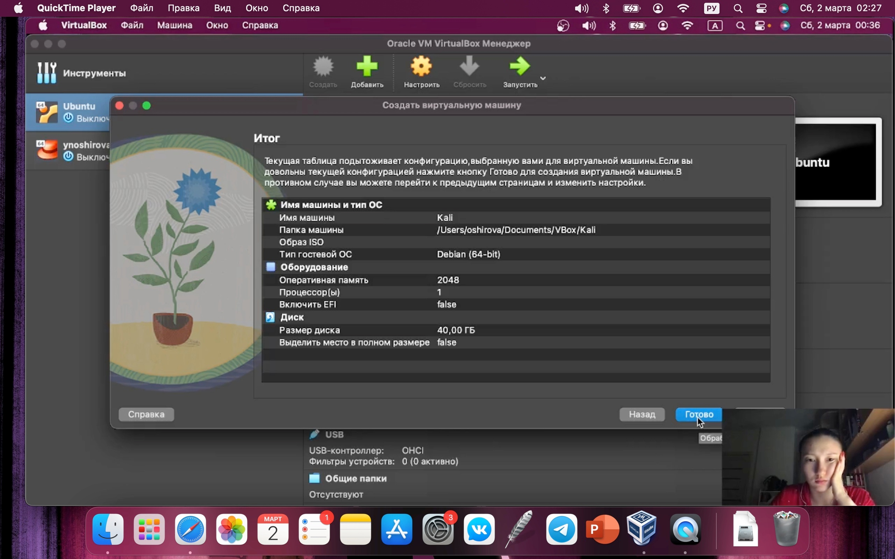
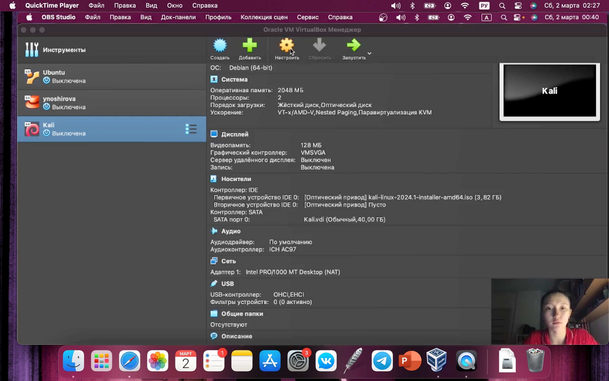
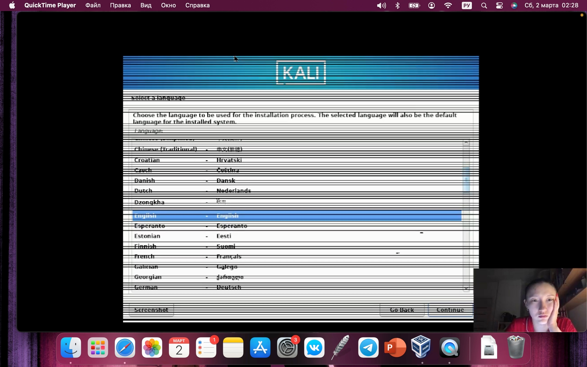
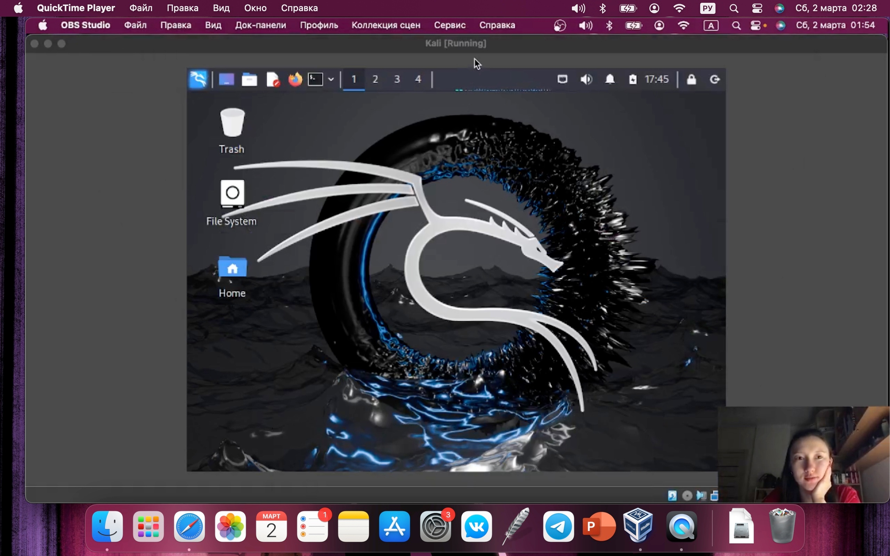

---
## Front matter
title: "Индивидульный проект - 1 этап"
subtitle: "Основы инцормационной безопасности"
author: "Юлия Оширова Николаевна"

## Generic otions
lang: ru-RU
toc-title: "Содержание"

## Bibliography
bibliography: bib/cite.bib
csl: pandoc/csl/gost-r-7-0-5-2008-numeric.csl

## Pdf output format
toc: true # Table of contents
toc-depth: 2
lof: true # List of figures
lot: true # List of tables
fontsize: 12pt
linestretch: 1.5
papersize: a4
documentclass: scrreprt
## I18n polyglossia
polyglossia-lang:
  name: russian
  options:
	- spelling=modern
	- babelshorthands=true
polyglossia-otherlangs:
  name: english
## I18n babel
babel-lang: russian
babel-otherlangs: english
## Fonts
mainfont: PT Serif
romanfont: PT Serif
sansfont: PT Sans
monofont: PT Mono
mainfontoptions: Ligatures=TeX
romanfontoptions: Ligatures=TeX
sansfontoptions: Ligatures=TeX,Scale=MatchLowercase
monofontoptions: Scale=MatchLowercase,Scale=0.9
## Biblatex
biblatex: true
biblio-style: "gost-numeric"
biblatexoptions:
  - parentracker=true
  - backend=biber
  - hyperref=auto
  - language=auto
  - autolang=other*
  - citestyle=gost-numeric
## Pandoc-crossref LaTeX customization
figureTitle: "Рис."
tableTitle: "Таблица"
listingTitle: "Листинг"
lofTitle: "Список иллюстраций"
lotTitle: "Список таблиц"
lolTitle: "Листинги"
## Misc options
indent: true
header-includes:
  - \usepackage{indentfirst}
  - \usepackage{float} # keep figures where there are in the text
  - \floatplacement{figure}{H} # keep figures where there are in the text
---

# Цель работы

Установите дистрибутив Kali Linux в виртуальную машину.

# Теоретическое введение

Kali Linux — GNU/Linux-LiveCD, возникший как результат слияния WHAX и Auditor Security Collection. Проект создали Мати Ахарони (Mati Aharoni) и Макс Мозер (Max Moser). Предназначен прежде всего для проведения тестов на безопасность. Наследник развивавшегося до 2013 года на базе Knoppix дистрибутива BackTrack.

Популярность Kali Linux выросла после показа в нескольких эпизодах сериала Mr. Robot. Инструменты, показанные в фильме, включают Bluesniff, Bluetooth Scanner (btscanner), John the Ripper, Metasploit Framework, nmap, Shellshock и wget.

# Выполнение лабораторной работы

Скачиваем Kali с официального сайта.
Устанавливаем Kali в Virtual Box. Настраиваем так же, как и прошлые дистрибутивы. Устанавливаем имя пользователя и пароль. Все скриншоты:

{#fig:001 width=70%}

{#fig:002 width=70%}

{#fig:003 width=70%}

{#fig:004 width=70%}

{#fig:005 width=70%}

{#fig:006 width=70%}

{#fig:007 width=70%}

# Выводы

Мы узнали о новом дистрибутиве Linux - Kali. Скачали и установили в Virtual Box.

# Список литературы{.unnumbered}

[1. Видео об установке дистрибутива Кали](https://vk.com/away.php?utf=1&to=https%3A%2F%2Fwww.youtube.com%2Fwatch%3Ftime_continue%3D4%26v%3DjlaVh22fFS8%26embeds_referring_euri%3Dhttps%253A%252F%252Fvk.com%252F%26embeds_referring_origin%3Dhttps%253A%252F%252Fvk.com%26source_ve_path%3DMjg2NjY%26feature%3Demb_logo)
